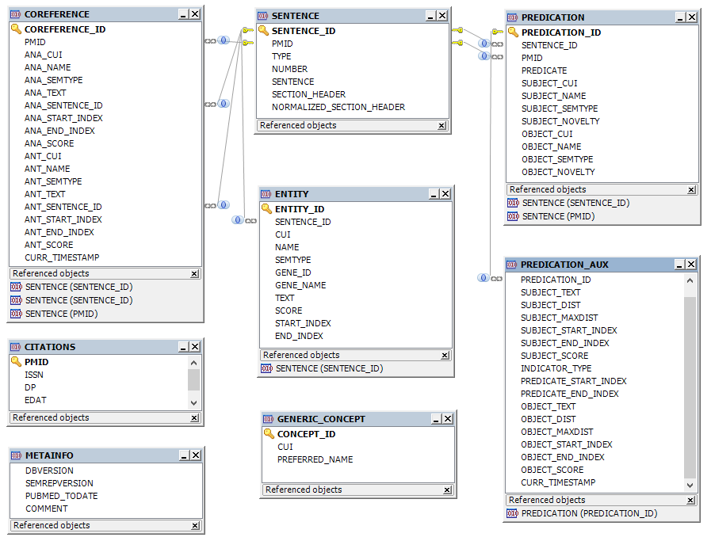
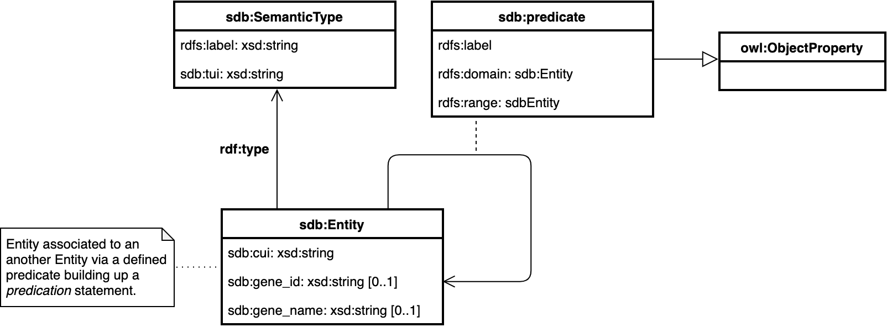

# Overview

This prototype demonstrates the various levels of integrating and exploring the freely available Semantic MEDLINE Database ([SemMedDB](https://skr3.nlm.nih.gov/SemMedDB/index.html)) in Stardog. The database is maintained and annualy updated by the U.S. National Library of Medicine (NLM). SemMedDB is automatically extracted via [SemRep](https://semrep.nlm.nih.gov) by parsing biomedical texts ([PubMed](https://www.ncbi.nlm.nih.gov/pubmed/) citations). As such it may support use cases of relation discovery, hypothesis generation, clinical decision making etc. 


# SemMedDB v3 Schema

The primary purpose of SemMedDB  is to capture *RDF-like* ternary relationships between biomedical entities (subject-predicate-object) extracted from scientifc sources. The SemMedDB database consists of [multiple tables](https://skr3.nlm.nih.gov/SemMedDB/dbinfo.html). These collect the  metadata about processed PubMed citations (table `CITATION`), the content of respective citations, i.e. the title or abstract (table `SENTENCE`), a number of formalized statments derived from this input (table `PREDICATION`), and auxiliary information on these predications (table `PREDICATION_AUX`) allowing, e.g., to assess the extraction quality. Table `COREFERENCE` lists the back references (optionally) generated by SemRep with Anaphora resolution. Additional information on entities involved in predications is covered by table `ENTITY`.



# Data Model
This demo focuses on showcasing integration and querying of (relational) biomedical data in Stardog. It leverages the `PREDICATION` table to retrieve  *predications* relating a biomedical *entity* (subject) to another entity (object) by means of a *predicate* such as `AFFECTS` or its negation (`NEG_AFFECTS`). The `ENTITY` table is integrated on demand to augment gene-specific information, i.e. the [Entrez Gene](https://www.ncbi.nlm.nih.gov/pmc/articles/PMC3013746/) ID (column `GENE_ID`) and name (column `GENE_NAME`) of entities being described in predictions:

Table | File size | Rows
--- | --- | ---
PREDICATION | 13Gb | 97.972.561
ENTITY | 123Gb | 1.369.837.426

The target graph model [semmeddb.ttl](model/semmeddb.ttl) trivially lifts the SemMedDB predications to RDF. Instances of the `sdb:Entity` class are related by the `sdb:predicate` relationship (derived from `owl:ObjectProperty`). The `sdb:SemanticType` class represents the concept behind an entity. The `sdb:Predication` class maintains references to elements of an individual predication, e.g. in order to evaluate and trace its validity. 



The following UML object diagram depicts the `sdb:associated_with` relation of the Cytokine gene (CUI `C1333196`, semantic type `gngm`, Gene or Genome) and GRASP gene (CUI `C1425726`) to the Asthma disease (CUI `C0004096`, semantic type `dsyn`, Disease or Syndrome):


## Identifiers

Entities in predictions are identified by a *concept unique identifier* (CUI) in the column `SUBJECT_CUI` or `OBJECT_CUI`. The most CUIs are atomic strings (`C0039258`) while 
3,28% of subject and 3% of object CUIs comprise a set of pipe-delimited parts, sample:

```
"C0668084"
"C0668084|2011|2149|8856|79581|145624"
"1523|4791|4940|6490|9733|22974|27044|84164"
```

The entities are further described by a readable name (column `SUBJECT_NAME` or `OBJECT_NAME`) and their *semantic type* (column `SUBJECT_SEMTYPE` or `OBJECT_SEMTYPE`). The naming convention apparently follows the CUI format with parts corresponding to positions in compound CUI and the name:

```
"Receptor, PAR-1"
"Receptor, PAR-1|MARK2|F2R|NR1I2|SLC52A2|PWAR1"
"CUX1|NFKB2|OAS3|PMEL|SART3|TPX2|SND1|ASCC2"
```
Depending on the interpretation of these composite identifiers alterantive mappings to Stardog's knowledge graph may apply:

1. The CUI is considered an *opaque* identifier, no particular handling appllies 
2. The parts correspond to *aliases* of given (first) entity and should be linked to it, the 
3. The parts correspond to *independent entities*, a new entity resource should be created for each. This approach may require a multi-pass integration

Similar ambiguity pertains to the `ENTITY` table. Some (TBD: ratio) of the entities indicate a list of comma-separated Entrez Gene IDs, maintained by the [National Center for Biotechnology Information](https://www.ncbi.nlm.nih.gov/gene) (NCBI), such as [PIF1 (80119)](https://www.ncbi.nlm.nih.gov/gene/?term=80119) and [DCD (117159)](https://www.ncbi.nlm.nih.gov/gene/?term=117159):

```
CUI       | GENE_ID
'C0016904','80119,117159'
'C0085828','2353,2354,3725,3726,3727'
'C0085828','2149,7012,7037,7296,10587,23671'
```

## Classes (Semantic Types)

The [semantic type](https://metamap.nlm.nih.gov/SemanticTypesAndGroups.shtml) (category) of entities at subject or object position of a predication consits of string identifier (e.g. `gngm`). NLM provides a delimiter-separated [file](https://metamap.nlm.nih.gov/Docs/SemanticTypes_2018AB.txt) to reslove their labels, sample:

```
...
ftcn|T169|Functional Concept
genf|T045|Genetic Function
geoa|T083|Geographic Area
gngm|T028|Gene or Genome
...

```
Applying virtual graph `import` command on mapping [`srdef.ttl`](mappings/srdef.ttl) this metadata is turned into class definitions, each semantic type being defined as subclass of the generic `sdb:SemanticType` class. For management purposes the model is maintained separately from data within a dedicated named graph (`urn:stardog:demo:semmeddb:model`). Following sample is retrieved by issuing the query [`retrieve_semantic_types.rq`](queries/retrieve_semantic_types.rq):

```
sdb:gngm rdfs:subClassOf sdb:SemanticType .
sdb:gngm rdfs:label "Gene or Genome"@en .
sdb:gngm sdb:tui "T028" .
...
```

## Predicates

[Kilicoglu et al.](https://www.researchgate.net/publication/51903378_Constructing_a_semantic_predication_gold_standard_from_the_biomedical_literature) provide definitions and usage examples of some predicates referenced by the `PREDICATION.PREDICATE` column. [66 distinct predicates](data/predicates.txt) were retrieved from the database. The mapping [`predicates.sms`](mappings/predicates.sms) consolidates their inconsistent spelling and creates appropriate `owl:ObjectProperty` definitions, making each predicate `rdfs:subPropertyOf` the generic `sdb:predicate`. Sample retrieved from `urn:stardog:demo:semmeddb:model` graph by issuing the query [`retrieve_semantic_types.rq`](queries/retrieve_semantic_types.rq):  

```
sdb:associated_with rdfs:subPropertyOf sdb:predicate .
sdb:associated_with rdfs:label "associated_with" .
```

# Demo Environment

An active MySQL instance (8.0.17) and Stardog (7.0.2) with a [MySQL JDBC-driver](https://dev.mysql.com/get/Downloads/Connector-J/mysql-connector-java-8.0.17.zip) installed in `$STARDOG_HOME/server/dbms/` or at `$STARDOG_EXT` are assumed. Any path expressions (files) below are relative to this project's home  directory (`demo-semmeddb`).

## Database

The SemMedDB is distributed as individual [MySQL import files](https://skr3.nlm.nih.gov/SemMedDB/download/download.html).  Please download, unpack and import the SemMedDB [PREDICATION table (2.51Gb)](https://skr3.nlm.nih.gov/SemMedDB/download/semmedVER40_R_PREDICATION.sql.gz), plus (optionally) the [ENTITY table (38.2Gb)](https://skr3.nlm.nih.gov/SemMedDB/download/semmedVER40_R_ENTITY.sql.gz)

1) Set-up the database `semmeddb4`

```sql
mysql>
	CREATE DATABASE semmeddb4 CHARACTER SET utf8mb4 COLLATE utf8mb4_unicode_ci;
	CREATE USER 'tester'@'%' IDENTIFIED BY 'stardog';
	GRANT ALL PRIVILEGES ON semmeddb4 . * TO 'tester'@'%';
	FLUSH PRIVILEGES;
```
2) Load the SQL-import files into `semmeddb4`

Note: Minified demo files ([`predication_dump.sql.gz`](data/predication_dump.sql.gz), [`entity_dump.sql.gz`](data/entity_dump.sql.gz)) were extracted from the original data allowing for an initial exploration. Their content is sufficient to serve referential queries below. Please adapt the the import commands accordingly. 

(a) Import via a background process on command line (recommended):

```console
bash>
 	nohup mysql -u tester --password=stardog semmeddb4 < semmedVER40_R_PREDICATION.sql &
	# Applies only when ENTITY table is used:
	nohup mysql -u tester --password=stardog semmeddb4 < semmedVER40_R_ENTITY.sql &
```
 or (b) via the mysql console: 
 
```sql	
mysql>
	USE semmeddb4 ;
	SOURCE semmedVER40_R_PREDICATION.sql;
	# Applies only when ENTITY table is used:
	SOURCE semmedVER40_R_ENTITY.sql;
```


Clean up an obviuos error, numeric predicates are invalid (3 rows affected):

```sql
mysql> 
	USE semmeddb4 ;
	DELETE FROM predication WHERE predicate IN ("127", "1532", "241") ;
```

## Stardog server

The following step to prepare the integration of the SemMedDB data in Stardog: 

Create the database `semmeddb` dedicating the named graph `urn:stardog:demo:semmeddb:model` for model maintenance:

```console
stardog-admin db create --name  semmeddb --options reasoning.schema.graphs=urn:stardog:demo:semmeddb:model --
```

Load the ontology file and dynamic, data-generated parts of the model into the graph `urn:stardog:demo:semmeddb:model`:

```console
stardog data add --format TURTLE --named-graph urn:stardog:demo:semmeddb:model semmeddb model/semmeddb.ttl
	
# Import generated type definitions
stardog-admin virtual import --named-graph urn:stardog:demo:semmeddb:model semmeddb mappings/srdef.properties mappings/srdef.ttl data/SemanticTypes_2018AB.txt

# Import generated predicate definitions
stardog-admin virtual import --named-graph urn:stardog:demo:semmeddb:model semmeddb --format SMS2 mappings/predicates.properties mappings/predicates.sms  

# Import the data
stardog-admin virtual import semmeddb --format SMS2  mappings/semmeddb.properties mappings/semmeddb_reification.sms
```

## Queries

Sample queries selecting genes that:

- are associated with Asthma *or* COPD: ([`genes_asthma_or_copd_materialized.rq`](queries/genes_asthma_or_copd_materialized.rq))
- are associated with Asthma but *not* COPD: ([`genes_asthma_not_copd_materialized.rq`](queries/genes_asthma_not_copd_materialized.rq))
- are associated with Asthma *and* COPD: ([`genes_asthma_and_copd_materialized.rq`](queries/genes_asthma_and_copd_materialized.rq))

## Constraints 

The Integrity Constraint Validation (ICV) subsystem allows to validate graph data entering and being stored in a Stardog database according to user defined rules expressed in a variety of formats (e.g. SHACL, OWL, SPARQL). The queries above intentionally rely on the "positive" version of SemMedDb predicates (`associated_with`) because a number of predications was found to contradict by using the negated version of same predicates (`neg_associated_with`). The ICV 
rule [`contradicting_predications_count.ttl`](constraints/contradicting_predications_count.ttl) applied to the `semmeddb`database revealed 112 negating predications to conflict:

```console
stardog icv explain semmeddb constraints/contradicting_predications.ttl
+-----------+
| neg_count |
+-----------+
| 112       |
+-----------+
```

The rule [`contradicting_predications.ttl`](rules/contradicting_predications.ttl) provides a listing of the conflicting predication pairs. 

# Statistics

System | Source row count | Loaded triples | Effective triples | Import time 
--- | --- | --- | --- | ---
MacBook Pro, Intel Core i9, 2,3 GHz, 8 cores, 16 GB memory | PREDICATION: 97.972.558, ENTITY: 37.859.114 | 37.898.857 | 177.802 | 6m 11.872s
SVM? | ENTITY: 803.174.282 | x | x | x

# Issues / Questions / Ideas
- Applicability of Stardog's ML models: spa:SimilarityModel / clustering
	- what were the arguments and the predicted value?
- Applicability of PATH queries
	- what could be related?
	- which predivcates were "transitive", "symmetric" etc.?
- Identification / selection of Asthma* or COPD*
	- there is a multiple related concepts on object position
		- Chronic obstructive pulmonary disease (COPD)
		- Asthma-COPD overlap syndrome (ACOS)?
- Some identifiers are clearly invalid (s. predicates)
- Multi-valued IDs, should we slplit/unnest them creating new resources?
	- on any position, sbject, object and entity
	- does the type (SUBJECT_SEMTYPE, e.g. Gene) still apply to any of these?
- Resolution of "EntrezGene ID" mandatory (needs to load and  join the Entity table)?
